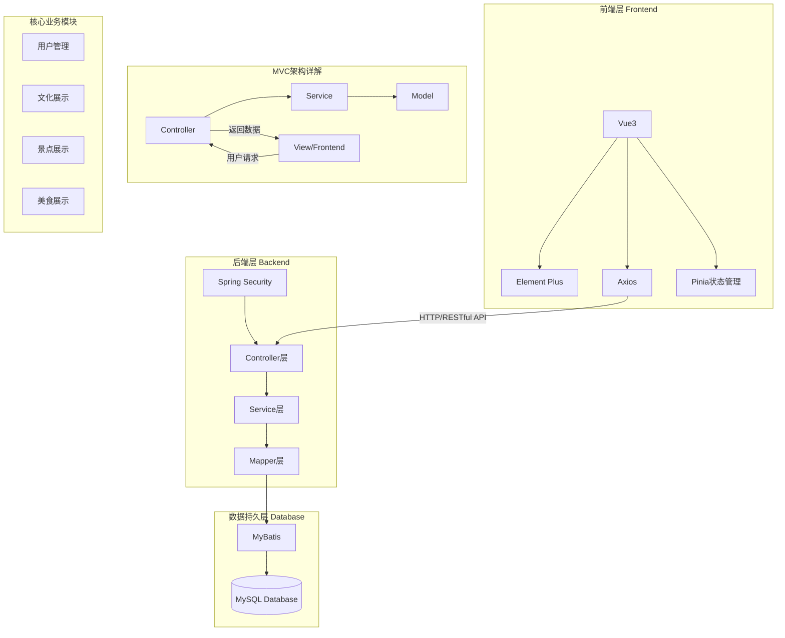
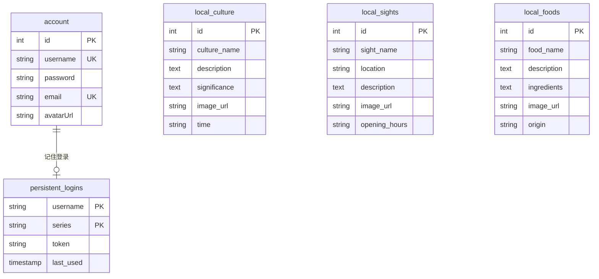

# 🏮 绍兴展示网站 (Shaoxing Showcase Web)

欢迎来到绍兴展示网站项目！让我们一起打造一个展现绍兴独特魅力的网上平台~ 🌟

## ✨ 项目介绍

这是一个专注于展示绍兴地区特色与魅力的全栈应用。项目采用现代化的前后端分离架构，就像绍兴的新与旧完美融合一样，我们的技术选型也是新潮与稳重的黄金组合！

- 💼 后端：强大的 Spring Boot 3 框架
- 🎨 前端：灵活的 Vue.js + Element Plus

## 🏗️ 项目结构


<div style="font-size:14px;color:gray;text-decoration:underline; text-align: center;">图1.系统架构图</div> 

### 🚀 后端项目 (shaoxing-showcase-web-backend)

```
后端技术清单：
- Spring Boot - 为我们提供稳如老酒的框架支持
- Git - 代码版本控制的得力助手
- Maven - 专业可靠的项目构建工具
```

### 🎯 前端项目 (shaoxing-showcase-web-frontend)

```
前端技术清单：
- Vue.js - 新一代的前端框架
- Vite - 闪电般的开发体验
- Element Plus - 优雅的 UI 组件库
```

## 📒 数据库设计


<div style="font-size:14px;color:gray;text-decoration:underline; text-align: center;">图2.数据库ER图</div>

## 🛠️ 快速开始

```bash
# 克隆前后端项目到本地
git clone https://gitee.com/HexWarrior6/shaoxing-showcase-web.git
```

### 后端环境准备

1. 📥 安装 Maven（就像准备厨房的锅碗瓢盆）
2. 📂 用你喜欢的 IDE 打开项目
3. 🗃️ 配置 MySQL 数据库并导入项目中的 [hexwarrior6shaoxingshowcase.sql](doc/deploy/hexwarrior6shaoxingshowcase.sql) 文件。

### 前端环境准备

1. 📦 安装 Node.js
2. ⚡ 运行 `npm install` 安装依赖
3. 🚀 启动开发服务器

## 🎮 运行项目

### 后端启动

> 选择以下任意一种方式

- 使用maven运行

```bash
# 进入后端文件夹
cd shaoxing-showcase-web-backend
```

```bash
mvn spring-boot:run
```

- 直接在 IDE 中运行

### 前端启动

```bash
# 进入前端文件夹
cd shaoxing-showcase-web-frontend
```

```bash
# 确保已经安装了依赖
npm install
```

```bash
# 启动开发服务器
npm run dev
```

访问 http://localhost:5173 就能看到我们的作品啦！ 🎉

## 📦 项目依赖

### 后端依赖

- Spring Boot Starter Parent (3.4.1) - 坚实的地基
- Spring Boot Starter Web (8.0.33) - Web 开发必备
- Fastjson2 (2.0.53) - JSON 处理利器
- Lombok - 代码简化神器
- mybatis (3.0.3) - 持久化的好帮手

### 前端依赖

- Axios (^1.7.9) - 优雅的 HTTP 客户端
- Element Plus (^2.9.1) - 漂亮的 UI 组件库
- Pinia (^2.2.6) - 新一代状态管理
- 自动导入插件组合拳 (优化开发体验)
    - Unplugin-auto-import (^0.19.0)
    - Unplugin-vue-components (^0.28.0)

## 🧑‍💻 作者

[ HexWarrior6](https://gitee.com/hexwarrior6)
